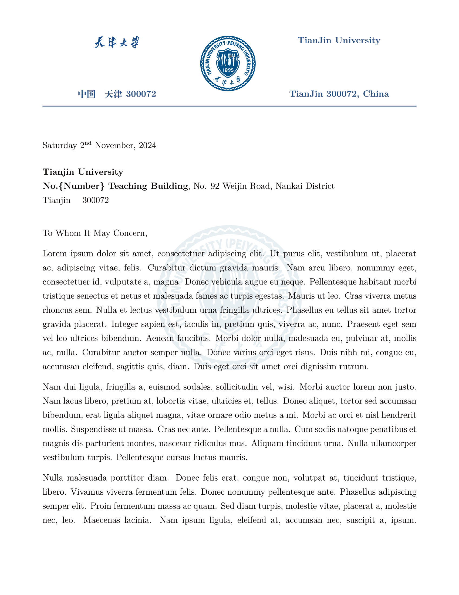
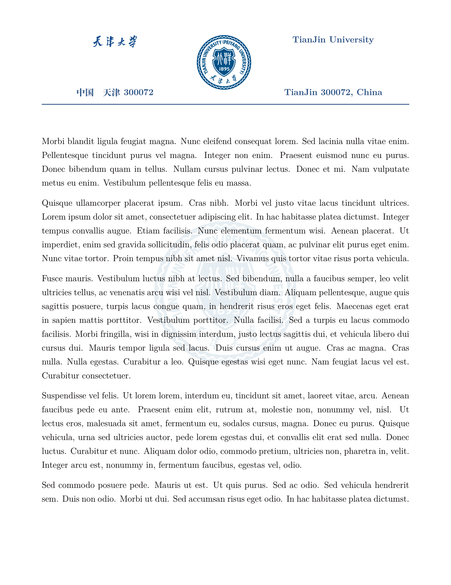
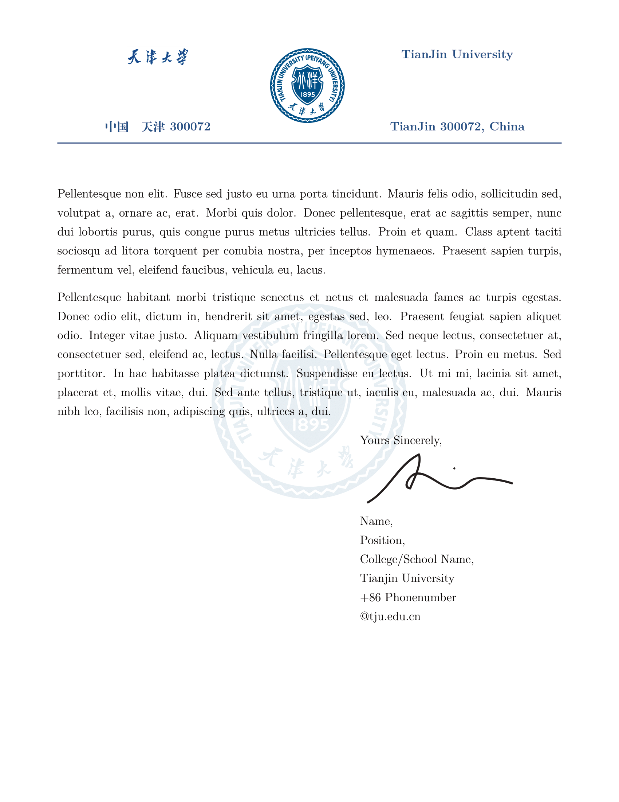

# Tianjin University Letterhead | 天津大学信纸

[English](#english) | [中文](#中文)

## English

This project offers a LaTeX letterhead template designed for Tianjin University, perfect for creating professional documents such as recommendation letters.

<table>
  <tr>
    <td></td>
    <td></td>
    <td></td>
  </tr>
</table>

### Requirements

To compile documents utilizing this template, please ensure the following prerequisites are satisfied:

- **Compiler**: XeLaTeX

- **TeX Distribution**: TeX Live 2024

*Alternatively, Overleaf may be employed by configuring the compiler to XeLaTeX and selecting TeX Live 2024. The primary document is `main.tex`.*

If you require only the letterhead section, a streamlined version is available at the following commit: [Streamlined Version - Commit 059528823d0c9e968eaf557c50af3aef5bf2a0d0](https://github.com/WilliamOdinson/Tianjin-University-Letterhead/tree/059528823d0c9e968eaf557c50af3aef5bf2a0d0)

---

## 中文

本项目提供了一款专为天津大学设计的 LaTeX 信头模板，适用于制作专业文档，如推荐信。

### 要求

使用此模板编译文档时，请确保具备以下条件：

- **编译器**：XeLaTeX

- **TeX 发行版**：TeX Live 2024

*或者，您可以使用 Overleaf，将编译器设置为 XeLaTeX 并选择 TeX Live 2024。主文档为 `main.tex`。*

如果您只需要信头部分，可以在以下提交中找到简化版本：[简化版本 - Commit 059528823d0c9e968eaf557c50af3aef5bf2a0d0](https://github.com/WilliamOdinson/Tianjin-University-Letterhead/tree/059528823d0c9e968eaf557c50af3aef5bf2a0d0)
