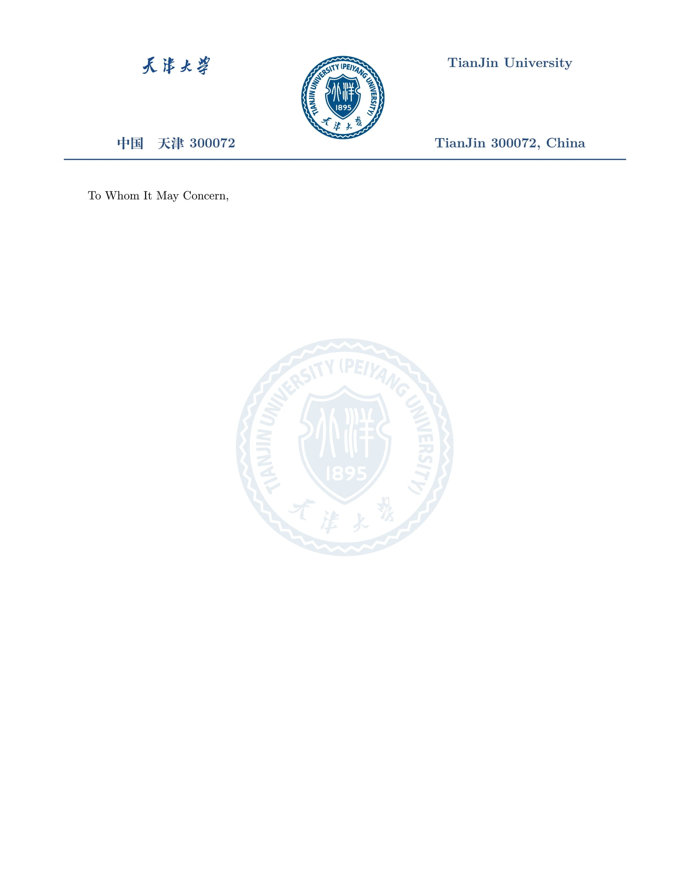

# 天津大学信头

[English](#english) | [中文](#中文)

## English

This project offers a LaTeX letterhead template designed for Tianjin University, perfect for creating professional documents such as recommendation letters.

### Requirements

To compile documents using this template, ensure you have the following:

- **Compiler**: XeLaTeX

- **TeX Distribution**: TeX Live 2024

*Alternatively, you can use Overleaf by setting the compiler to XeLaTeX and selecting TeX Live 2024. The main document is `main.tex`.*

### Future Enhancements

Future enhancements include additional recommendation letter templates.

---

## 中文

此项目提供一个为天津大学设计的 LaTeX 信头模板，适用于创建专业文档，如推荐信。

### 要求

要使用此模板编译文档，请确保您具备以下条件：

- **编译器**：XeLaTeX

- **TeX 发行版**：TeX Live 2024

*或者，您可以使用 Overleaf，将编译器设置为 XeLaTeX，并选择 TeX Live 2024。主文档为 `main.tex`。*

### 未来增强

未来的增强功能包括更多的推荐信模板。
